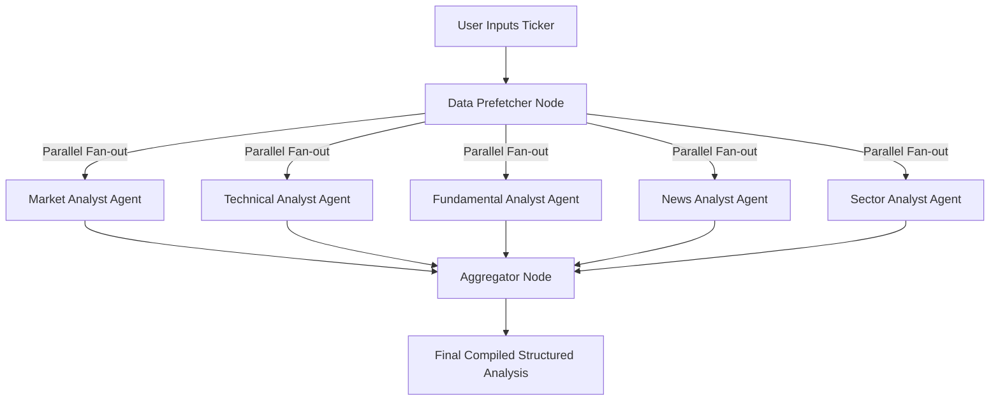

#  AI-Powered Market Intelligence & Trading Agent System

[](https://opensource.org/licenses/MIT)

A lightweight, multi‑agent system for market intelligence and investment decision support. It combines retrieval‑augmented generation (RAG) with government and regulatory data, then uses a debate loop and risk‑aware branching to produce balanced, actionable insights.

---

##  Core Idea

Instead of a single model, the system uses **specialised agents** that collaborate:

- **Market, Social, News, Fundamentals** analysts gather and interpret data.
- **Bull vs. Bear researchers** debate each opportunity.
- A **Research Manager** synthesises the arguments.
- **Risk profiles** (aggressive / conservative) determine the final strategy.
- A **Portfolio Manager** allocates assets visualizing the real time news and data.

All analysis can be grounded in real‑world documents (policies, filings, reports) via RAG.

##  Key Capabilities of trade agent

- **RAG on Indian government & regulatory sources** (Ministry of Commerce, SEBI, RBI)
- **Multi‑agent reasoning** with clear separation of concerns
- **Debate‑based validation** (Bull/Bear) to reduce bias
- **Risk‑branching** for different investment styles
- **Modular design** – easy to extend with new agents or data sources

---

##  Use Cases

- Sector research and policy impact analysis
- AI‑assisted trading signals
- Investment decision support for funds or individuals
- Educational platform for multi‑agent AI in finance

---

##  Future Possibilities

- Real‑time data feeds
- Reinforcement learning for adaptive strategies
- Cross‑market expansion (global equities)

---

##  Contributing

Contributions are welcome! Feel free to fork the repository, open issues, or submit pull requests. Please adhere to the existing design principles and add tests for new agents or tools.

1. Fork the project
2. Create your feature branch (`git checkout -b feature/amazing-feature`)
3. Commit your changes (`git commit -m 'Add some amazing feature'`)
4. Push to the branch (`git push origin feature/amazing-feature`)
5. Open a Pull Request

---

##  Contact

For questions, suggestions, or collaborations, please reach out to: **conpectworksx@gmail.com**

---

##  License

MIT

---

*Built with modularity, explainability, and real‑world financial data in mind.*
# Artha Analytics (AI-Powered Equity Research & Trading Agent System)

[](https://opensource.org/licenses/MIT)
[](https://fastapi.tiangolo.com/)
[](https://nextjs.org/)
[](https://github.com/langchain-ai/langgraph)

**Artha Analytics** is an institutional-grade, multi-agent AI equity research and market intelligence platform specialized for Indian markets (NSE). By orchestrating a parallel multi-agent debate and evaluation system using **LangGraph**, it analyzes any stock ticker from technical, fundamental, market, sector, and news perspectives—delivering compiled reports and interactive visual charts in under 20 seconds.

---

## 🔗 Live Deployments
* **Frontend Web Application (Vercel):** [https://artha-analytics.vercel.app/](https://artha-analytics.vercel.app/)
* **Backend API Service (Render):** [https://artha-analytics.onrender.com](https://artha-analytics.onrender.com)

---

## 🤖 Multi-Agent LangGraph Workflow

Rather than relying on a single prompt or model, Artha Analytics runs a structured, parallel agent workflow built on **LangGraph**. A centralized **Data Prefetcher** gathers all market data from external APIs safely and serializes Yahoo Finance operations to avoid rate limits, then fans out to five specialized reasoning agents:



### The Analyst Agents
1. **Market Analyst**: Evaluates macro-environment indicators and global/local market indices including **S&P 500, NASDAQ, Volatility VIX, NIFTY 50, and SENSEX** to establish broader market sentiment.
2. **Technical Analyst**: Runs quantitative calculations on the historical price series, evaluating:
   - **Momentum Indicators**: RSI (Relative Strength Index) and MACD (Moving Average Convergence Divergence).
   - **Volatility Indicators**: Bollinger Bands and ATR (Average True Range).
   - **Volume/Trend Dynamics**: VWMA (Volume-Weighted Moving Average), MFI (Money Flow Index), moving average crossovers (10, 50, 100, 200 SMAs), golden/death crosses, volume surges, and 52-week price channels.
3. **Fundamental Analyst**: Details company financials:
   - Full analysis of **Balance Sheet, Income Statement, and Cash Flow Statement**.
   - Valuation ratios (**P/E, P/B, EV/EBITDA**) and EPS trends.
   - Core growth metrics to evaluate financial viability.
4. **News Analyst**: Aggregates the latest financial articles and press releases, performing sentiment analysis and outlining potential catalyst events.
5. **Sector Analyst**: Examines sector-specific trends, regulatory headwinds/tailwinds, and benchmark comparisons with direct peers.
6. **Aggregator Node**: Compiles and formats all analyst viewpoints into a clean, markdown-friendly response structure for the user.

---

## ⚡ Key Features

* **Bring Your Own Key (BYOK) Model**: Users can supply their own Groq API keys locally for unlimited analysis, validated through API key format and connection checkers.
* **Guest Rate Limiting & User Management**:
  - Guest users receive up to **3 free analyses** tracked securely by client IP (using MongoDB and FastAPI rate limiters).
  - Secure **Email Signup/Login** using JSON Web Tokens (JWT) and integrated **Google OAuth** login.
  - Interactive profile dialogs to update passwords and manage credentials.
* **Interactive Frontend Dashboards**:
  - **Real-time Price Metrics Panel**: Displays 52-week ranges, trading volumes, and daily move ranges.
  - **Dynamic Charting**: Built-in **Technical Indicators History Chart** and **Financial Metrics History Chart** powered by Recharts.
  - Beautiful, responsive interfaces styled with custom CSS and Framer Motion micro-animations.
  - **PDF Export & Copy Utility**: Export the full compiled agent analysis report as a PDF directly from the dashboard.

---

## 🛠 Tech Stack

### Frontend
* **Framework**: Next.js 15 (App Router), React 19, TypeScript
* **State & Fetching**: TanStack React Query v5
* **Animations**: Framer Motion, Tailwind CSS
* **Charting**: Recharts
* **Search**: Fuse.js (Fuzzy-matching tickers locally)
* **Utilities**: jsPDF, React Markdown, Lucide Icons, React Icons, Sonner toasts

### Backend
* **Runtime**: Python (>= 3.11)
* **API Framework**: FastAPI, Uvicorn
* **Agent Framework**: LangGraph, LangChain Core, LangChain Groq
* **Database**: MongoDB (IP limits, Auth management)
* **Authentication**: PyJWT, Google Auth client libraries
* **Data Sources**: yfinance (with centralized serialization locking), ta (Technical Analysis library)
* **Rate Limiting**: SlowAPI

---

## 🚀 Local Development Setup

### Backend Setup
1. **Navigate to the backend directory**:
   ```bash
   cd backend
   ```
2. **Install dependencies** (recommended to use `uv` or standard virtual environment):
   ```bash
   python -m venv .venv
   source .venv/bin/activate
   pip install -r requirements.txt   # Or run 'uv sync' if using uv
   ```
3. **Configure environment variables**:
   Create a `.env` file based on `.env.example`:
   ```env
   GROQ_API_KEY=your_groq_api_key_here
   MONGODB_URI=your_mongodb_connection_string
   ```
4. **Start the FastAPI server**:
   ```bash
   python api/main.py
   ```
   The backend will be running on `http://localhost:8000`.

### Frontend Setup
1. **Navigate to the frontend directory**:
   ```bash
   cd ../frontend
   ```
2. **Install packages**:
   ```bash
   npm install
   ```
3. **Configure environment variables**:
   Create a `.env` file:
   ```env
   NEXT_PUBLIC_API_URL=http://localhost:8000
   NEXT_PUBLIC_GOOGLE_CLIENT_ID=your_google_client_id_here
   ```
4. **Run the development server**:
   ```bash
   npm run dev
   ```
   Open `http://localhost:3000` to interact with the application.

---

## 📄 License
This project is licensed under the [MIT License](LICENSE).
